**<h3>The Lab Report**

**<h4>The Commands without Arguments**

- "cd" did nothing and only created a new line waiting for another command

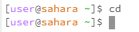

- "ls" wrote in the terminal the only item in the workplace "lecture1" then created a new line waiting for another command

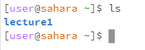

- "cat" was a little more interesting while it didn't write anything to the terminal and did create a new line it didn't have [user@sahara~]$. Instead anything that I wrote afterwards would be repeated as though I had called the cat command on those statements. This included just pressing enter skipping two lines instead of one. In order to leave I learned via google that ctrl-d would allow me to back track to once again show [user@sahara~]$

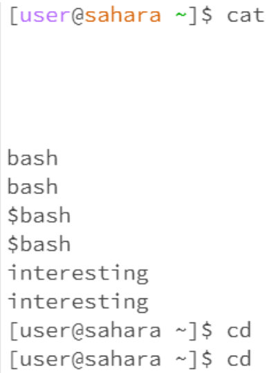

**<h4>The Commands with the Directory**

- "cd" entered the directory that I wrote after it
  
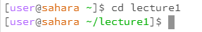

- "ls" wrote down the name of files and directorys with in the choosen directory but only the names.
  
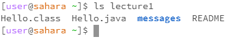 

- "cat" wrote in the terminal somethat that suggest to me directorys cannot be copied into the terminal. most likely due the fact that, it could lead to significantly more information that was asked for.

- all of the commands when attempting to access the directory "messages" while not in "lecture1" all had slightly different but ultimately it wasn't something can could be viewed from [user@sahara~]$ (see left) if I wanted it to work I would need to cd lecture1, which would bring me to a [user@sahara ~lecture1]$ (see right) where I could then enter messages, using any of the commands tho cat also

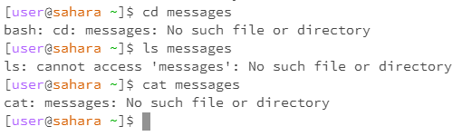 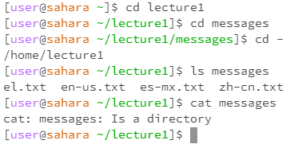

**<h4>The Commands with the Files**

Being that there are no file in the base Workspace I needed to cd into Lecture1 to access the files to proper attempts the commands else it will say "no such directory or file" similar when we attempt to use commands on a directory that it couldn't access.

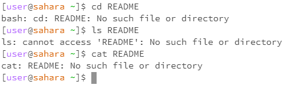

- "cd" command failed as this is a file and not a directory
  
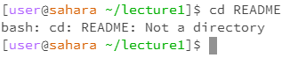

- "ls" copied it's own name as it's the only item in that list
  
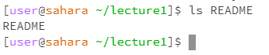 

- "cat" copied the contents of the file

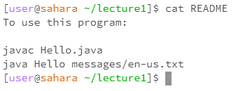

