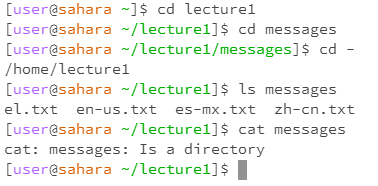
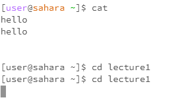
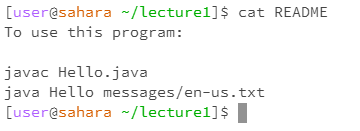

# The Lab Report 1

### The Cd Command

#### Cd with no arugment

- "cd" did nothing and only created a new line waiting for another command

- if you do "cd" while in working directory other than /home it returns you to /home for edstem terminal

  

#### Cd with a Directory 

- "cd" entered the directory that I wrote after it
  
  

##### NOTE

- all of the commands when attempting to access the directory "messages" while not in "lecture1" resulted slightly different but ultimately it wasn't something can could be viewed from [user@sahara~]$ (see left) if I wanted it to work I would need to cd into a lecture1, which would bring me to a [user@sahara ~lecture1]$ (see right) where I could then enter messages, using any of the commands, though cat was still not accepted.

   

#### Cd with a File

- "cd" command failed as this is a file and not a directory

  
  

##### NOTE

Being that there are no file in the base Workspace I needed to cd into Lecture1 to access the files to proper attempts the commands else it will say "no such directory or file" similar when we attempt to use commands on a directory that it couldn't access. This holds true for all the commands used in this lab

  

### The ls Command

#### ls with no arguments

- "ls" wrote in the terminal the only item in the workplace (/home) "lecture1" then created a new line waiting for another command if it was in another directory it would print out the names of those directories and files instead.

  

#### ls with a Directory

- "ls" wrote down the name of files and directorys with in the choosen directory but only the names.
  
   

#### ls with a File

- "ls" copied it's own name as it's the only item in that list
  
  

### The cat Command

#### cat with no arguments

- "cat" was a little more interesting while it didn't write anything to the terminal and did create a new line it didn't have [user@sahara~]$. Instead anything that I wrote afterwards would be repeated as though I had called the cat command on those statements. This included just pressing enter skipping two lines instead of one. In order to leave I learned via google that ctrl-d would allow me to back track to once again show [user@sahara~]$

  

#### cat with a Directory

- "cat" wrote in the terminal "lecture1: is a directory" which just means you can't copy **to the terminal** the context of a directory. This makes sense cause if it was able to cat, it would have to also look with in a directory to find files in it print out, I image there are too many edge cases to make it worth it. Although there maybe another command we have haven't encountered yet with that functionality.

  

#### cat with a File

- "cat" copied the contents of the file

  

