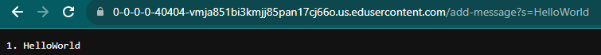
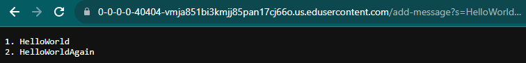
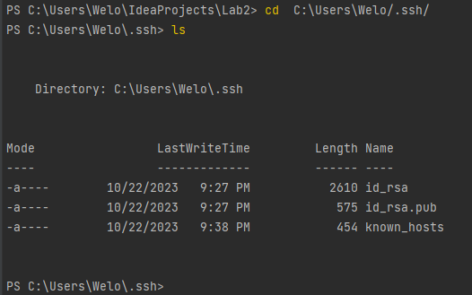
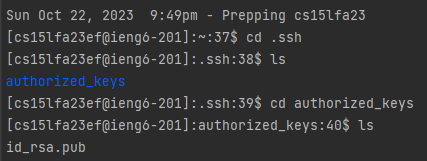
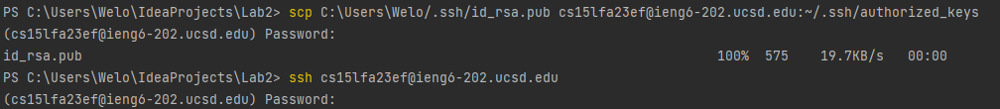

# The Lab Report 1

## PART 1

`import java.io.IOException;
import java.net.URI;
import java.util.ArrayList;

class Handler implements URLHandler {
    // The one bit of state on the server: a number that will be manipulated by
    // various requests.
    int num = 1;

    StringBuffer buf = new StringBuffer();

    String theR = new String();

    public String handleRequest(URI url) {
        if (url.getPath().equals("/")) {
            return theR;
        } else {
            if (url.getPath().contains("/add-message")) {
                String[] parameters = url.getQuery().split("s=");
                buf.append(num++ + ". ");
                buf.append(parameters[1]);
                buf.append("\n");
                theR = buf.toString();
                return theR;
            }
            return "404 Not Found";
        }
    }
}

class StringServer {
    public static void main(String[] args) throws IOException {
        if(args.length == 0){
            System.out.println("Missing port number! Try any number between 1024 to 49151");
            return;
        }

        Integer port = Integer.parseInt(args[0]);

        Server.start(port, new Handler());
    }
}

`

#### First add-message

- Method handleRequest(URI url) is called
- the query arugment is called, the parameter is set to everything after "s=" which is added to the Stringer buffer, after num + ". " and before a next line string shortcut, the entire buffer is converted to a string and then is returned.
- num is incremented in after it's appended into the string buffer so it's increased for the next time. alternatively I could've started num at 0 and did ++num istead but num++ is what I'm more used to.

  

#### Second add-message 

- Similarly Method handleRequest(URI url) is called
- Again the query arugment is called, the parameter is set to everything after "s=" which is added to the Stringer buffer, after num + ". " and before a next line string shortcut, the entire buffer is converted to a string and then is returned. Instead this time buffer already has from the previous query so it returns both the previous and new strings.
- num is again incremented incase we wanted to do another /add-message?s="String"
  
  

## PART 2

  

  
  

  

## PART 3

- I learned a little more on how to move around items in github through git mv, push etc however it's quite difficult and I don't have it quite down yet.
- I learned how to create a key and access the information for the key in my own computer and with in a remote computer but the means by which it functions still alludes me
- I learned that mkdir is very nice for creating directory and scp is a more advance variant of cp which is copy paste from what I understand

