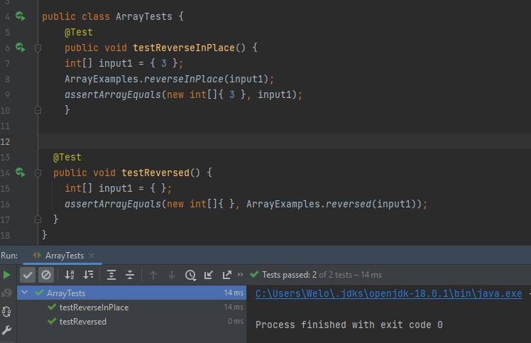
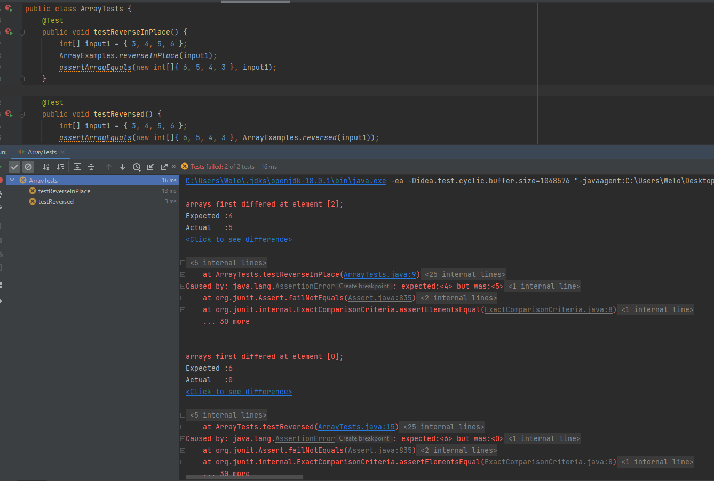

### The Lab Report 3

#### Part 1


- A failure-inducing input for the buggy program, as a JUnit test and any associated code (write it as a code block in Markdown)

    ```cpp
    import static org.junit.Assert.*;
    import org.junit.*;
    
    public class ArrayTests {
    	@Test 
    	public void testReverseInPlace() {
        int[] input1 = { 3, 4, 5, 6 };
        ArrayExamples.reverseInPlace(input1);
        assertArrayEquals(new int[]{ 6, 5, 4, 3 }, input1);
    	}
    
      @Test
      public void testReversed() {
        int[] input1 = { 3, 4, 5, 6 };
        assertArrayEquals(new int[]{ 6, 5, 4, 3 }, ArrayExamples.reversed(input1));
      }
    }
  
    ```
    
- An input that doesn’t induce a failure, as a JUnit test and any associated code (write it as a code block in Markdown)

    ```cpp
    import static org.junit.Assert.*;
    import org.junit.*;
  
      public class ArrayTests {
      	@Test 
      	public void testReverseInPlace() {
          int[] input1 = { 1 };
          ArrayExamples.reverseInPlace(input1);
          assertArrayEquals(new int[]{ 1 }, input1);
      	}
    
      @Test
      public void testReversed() {
        int[] input1 = {};
        assertArrayEquals(new int[]{}, ArrayExamples.reversed(input1));
      }
    }
    ```

 - The symptom, as the output of running the tests (provide it as a screenshot of running JUnit with at least the two inputs above)

   

   


 - The bug, as the before-and-after code change required to fix it (as two code blocks in Markdown)

    ```cpp
    ///Broke Code
    public class ArrayExamples {

      // Changes the input array to be in reversed order
      static void reverseInPlace(int[] arr) {
        for(int i = 0; i < arr.length; i += 1) {
          arr[i] = arr[arr.length - i - 1];
        }
      }
      // Returns a *new* array with all the elements of the input array in reversed
      // order
      static int[] reversed(int[] arr) {
        int[] newArray = new int[arr.length];
        for(int i = 0; i < arr.length; i += 1) {
          arr[i] = newArray[arr.length - i - 1];
        }
        return arr;
      }
    }
    ```
  
    ```cpp
    //fixed Code
    public class ArrayExamples {
  
      // Changes the input array to be in reversed order
      static void reverseInPlace(int[] arr) {
        for(int i = 0; i < arr.length/2; i += 1) {
          int temp = arr[arr.length - i - 1];
          arr[arr.length - i - 1] = arr[i];
          arr[i] = temp;
        }
      }
      // Returns a *new* array with all the elements of the input array in reversed
      // order
      static int[] reversed(int[] arr) {
        int[] newArray = new int[arr.length];
        for(int i = 0; i < arr.length; i += 1) {
          newArray[i] = arr[arr.length - i - 1];
        }
        return newArray;
      }
    }

    ```

- Briefly describe why the fix addresses the issue.

##### "reverseInPlace" Method:

    ``` 
    Bug: 
    1. Values in the front are written and lost
    2. It iterates from 0 to length-1
    
    Symptoms: 
    [1, 2, 3]
    for i = 0
    it flips the item in A[0] and length-0-1 or A[2], which are the values 1 and 3 respectively 
    The A[0] is set to A[2]
    [3, 2, 3]
    
    then for i = 1
    it flips the item in A[1] and length-1-1 or A[1], which is the value 2
    A[1] remains the same as it's set to itself
    [3, 2, 3]
    etc.
    
    Doesn't reverse but rather Mirrors the back of the array to the front
  
    ```

##### "reverseInPlace" Method Fixed:

    ```
    Bug Fixes:
      1:
      - create a temporary value to hold the arr[length-1-i]
      - Sets arr[length-1-i] to arr[i]
      - arr[i] the stored value of arr[length-1-i] in temp 
      Maintain the discription of InPlace and flips the values
      2:
      - the for loop is changed from going for i < length to i < length/2
      This ensures that values aren't look at more than once which would have resulted in the list being 
      flipped back to the original orientation after passing the half way point which is not what we want.
    ```

##### "reversed" Method:

    ``` 
    Bug: 
      1. Sets the value of arr[] to the values of newArray[] which is an empty array
      2. Returns the original array rather than the new array ie returns arr;
    
    Symptoms: 
    [1, 2, 3]
    for i = 0
    it sets the value of A[0] to A.length-0-1 of the newArray or newArray[2], which are the values 0
    The A[0] is set to newArray[2]
    [0, 2, 3]
    
    then for i = 1
    it sets the value of A[1] to A.length-1-1 of the newArray or newArray[1], which are the values 0
    The A[0] is set to newArray[2]n 
    [0, 0, 3]
    
    etc
    
    Doesn't reverse but rather deletes the original array which in turn returns an empty array.
    
    ```

##### "reversed" Method Fixed:

    ```
    Bugs Fixes:
      1:
      - set newArray[i] to arr[arr.length-1-i]
      Stores the values of arr[] in the reversed order in newArray[]
      2:
      - return newArray;
      Returns the newly created reversed copy of arr
    ```


#### Part 2


I asked ChatGPT  "Can you give me 4 grep commands in bash outside of the base grep command"

ChatGPT replied 

"Certainly! Here are four grep commands in Bash that utilize some of the extended features and options available outside of the basic grep command:"

1. Using 'egrep' (Extended 'grep') to search for multiple patterns:

```egrep "pattern1|pattern2" filename.txt``` in bash

NOTE: I asked ChatGTP later "how to do 'and' in grep" to which is responded 
```grep -E ".*pattern1.*pattern2.*" filename.txt```

This command uses 'egrep' to seach for lines containing either "pattern1" or "pattern2" in the file 'filename.txt'. The '|' (pipe) character functions as a logical OR. 

2. Using grep with the -B and -A options (Before and After Context Lines):

```grep -B 2 -A 2 "search_term" filename.txt``` in bash

will search for "search_term" in the file 'filename.txt' and show two lines before and two lines after each match, providing a more comprehensive view of the context in which the search term appears in the file. You can adjust the number of context lines as needed by changing the values for '-B' and '-A'.

3. Using 'grep' with word boundaries for exact word matching 

```grep -w "exact_word" filename.txt``` in bash

This command utilizes the '-w' option to match the word "exact_word" exactly, ignoring partial matches or substrings in the file 'filename.txt'.

4. Using grep with the context option to display surrounding lines:

```grep -C 2 "search_term" filename.txt``` in bash

This command uses the '-C' option to display two lines of context (one line before and one line after) for each occurrence of "search_term" in the file 'filename.txt'.

These 'grep' commands demonstrate some advanced features and options that can be used to enhance your text pattern searching and matching capabilities. You can adapt these commands to suit your specific search requirements


I made note of the slight difference between egrep, as the one that was given to me, and grep so I asked ChatGPT "what is the difference between egrep and grep"

Which it replied giving a fairly long explination but the summary was.

"the main difference is that 'egrep' supports Extended Regular Expressions, making it easier to write and read regular expressions that include special characters. 'grep', on the other hand, uses Basic Regular Expressions by default, so you would need to escape these special characters if you want to use them in your regular expressions. You can also enable Extended Regular Expressions in 'grep' by using the '-E' option, like 'grep -E "pattern" filename.txt', which would make it function similarly to 'egrep'."


Example 1: egrep

'or' input/output

```
Welo@LAPTOP-4LNG7MDC MINGW64 ~/IdeaProjects/Lab415l/docsearch/technical (main)
$ egrep "falling|jumping" 911report/*.txt
911report/chapter-11.txt:                in fact Mihdhar and his companions had dispersed and the tracking was falling apart.
911report/chapter-13.2.txt:                falling below the norm for metal detection. No FAA Special Assessments (by "red
911report/chapter-13.5.txt:                people jumping, see Civilian interview 13 (Mar. 25, 2004); Commission analysis of
911report/chapter-13.5.txt:                killed below the impact zone, either by falling debris, by the fireballs that
911report/chapter-7.txt:                falling from the sky, mass killing, and hijacking. Further, when detained as a
911report/chapter-9.txt:                some civilians on upper floors were jumping or falling from the building. They also
911report/chapter-9.txt:                could walk to vacate the area immediately. Putting themselves in danger of falling
911report/chapter-9.txt:                to the north and east so that they might avoid falling debris and victims.
911report/chapter-9.txt:                approaching lower floors. Other evacuees were killed earlier by debris falling on
911report/chapter-9.txt:                endangered by falling debris and people on West Street, on the plaza between the
911report/chapter-9.txt:                time to 6 WTC, dodging those who still were jumping from the upper floors of the
biomed/1475-2875-1-14.txt:        measures. The proportion of households falling within the
biomed/ar319.txt:          falling off at surrounding windows. Although the current
biomed/cc2171.txt:          degradation products plus a falling platelet count of 25%
biomed/gb-2001-2-11-research0046.txt:            majority of strain pairs falling in the range of 30-70%
biomed/gb-2001-3-1-research0005.txt:        samples with 98% [ 3] of the points falling within a region
biomed/gb-2002-3-10-research0052.txt:          were recorded as either falling entirely within the
biomed/gb-2002-3-11-research0062.txt:        points falling outside the 2 SD limit. This suggests that
biomed/gb-2002-3-12-research0079.txt:          interval not falling into one of these categories was
biomed/gb-2002-3-6-research0029.txt:          alignments display multiple splicing anomalies, falling
```


'and' input/output

```
Welo@LAPTOP-4LNG7MDC MINGW64 ~/IdeaProjects/Lab415l/docsearch/technical (main)
$ egrep ".*the.*fall." 911report/*.txt
911report/chapter-10.txt:                    of the fallen buildings.
911report/chapter-11.txt:                were at a loss to know where the blow would fall or what more might be done to
911report/chapter-11.txt:                1999, once more in the fall of 2000, and again in the summer of 2001. Delivering it
911report/chapter-11.txt:                in fact Mihdhar and his companions had dispersed and the tracking was falling apart.
911report/chapter-11.txt:                scarcely knew that the case had fallen apart. The director of the Counterterrorist
911report/chapter-12.txt:            Because the Muslim world has fallen behind the West politically, economically, and
911report/chapter-12.txt:            Afghanistan was the incubator for al Qaeda and for the 9/11 attacks. In the fall of
911report/chapter-12.txt:                United States. By 2003, polls showed that "the bottom has fallen out of support for
911report/chapter-12.txt:                last summer, favorable ratings for the U.S. have fallen from 61% to 15% in Indonesia
911report/chapter-13.2.txt:                primary means of coordinating emergencies, and they fall into two categories:"event"
911report/chapter-13.3.txt:                support for terrorism or on other issues, such as human rights. In the fall of 1995,
911report/chapter-13.3.txt:            76. By the fall of 1999, the Glenn, Pressler, and Symington amendments prohibited
911report/chapter-13.3.txt:                around in the fall of 2000.
911report/chapter-13.3.txt:            193. This figure increased through the fall of 1999, from less than 5 percent on
911report/chapter-13.4.txt:                there is evidence that al Qaeda experienced funding shortfalls as part of the
911report/chapter-13.5.txt:                killed below the impact zone, either by falling debris, by the fireballs that
911report/chapter-13.5.txt:                biological release or the use of conventional weapons falls to the NYPD. Dealing
911report/chapter-2.txt:            Bin Ladin Moves to Sudan By the fall of 1989, Bin Ladin had sufficient stature among
911report/chapter-2.txt:                traveled to Iran to receive training in explosives. In the fall of 1993, another
911report/chapter-3.txt:                that the rise and fall of intelligence budgets are tied directly to trends in
911report/chapter-3.txt:            By the fall of 1997, the Bin Ladin unit had roughed out a plan for these Afghan
911report/chapter-3.txt:                complete rehearsals in the United States during the fall of 1997.
911report/chapter-3.txt:                threat posed by al Qaeda, either in 1998 or later. In the late summer and fall of
911report/chapter-5.txt:                when Yousef was receiving explosives training in Afghanistan. During the fall of
...continues a little more
```


This command, egrep, allows a lot of customation options for precise and/or versitile text searches. It supports searching for expanded patterns or tailoring queries for a wide range of searchs.


Example 2: grep -B and -A

```
Welo@LAPTOP-4LNG7MDC MINGW64 ~/IdeaProjects/Lab415l/docsearch/technical (main)
$ grep -B 2 -A 2 "bro" 911report/*.txt
911report/chapter-1.txt-    None of the checkpoint supervisors recalled the hijackers or reported anything suspicious regarding their screening.
911report/chapter-1.txt-
911report/chapter-1.txt:    While Atta had been selected by CAPPS in Portland, three members of his hijacking team-Suqami, Wail al Shehri, and Waleed al Shehri-were selected in Boston. Their select
ion affected only the handling of their checked bags, not their screening at the checkpoint. All five men cleared the checkpoint and made their way to the gate for American 11. Atta, Omari, and Suq
ami took their seats in business class (seats 8D, 8G, and 10B, respectively). The Shehri brothers had adjacent seats in row 2 (Wail in 2A, Waleed in 2B), in the firstclass cabin. They boarded American 11 between 7:31 and 7:40. The aircraft pushed back from the gate at 7:40.
911report/chapter-1.txt-
911report/chapter-1.txt-    Shehhi and his team, none of whom had been selected by CAPPS, boarded United 175 between 7:23 and 7:28 (Banihammad in 2A, Shehri in 2B, Shehhi in 6C, Hamza al Ghamdi in 9C, and Ahmed al Ghamdi in 9D). Their aircraft pushed back from the gate just before 8:00.
911report/chapter-1.txt-
911report/chapter-1.txt:    Washington Dulles: American 77. Hundreds of miles southwest of Boston, at Dulles International Airport in the Virginia suburbs of Washington, D.C., five more men were pr
eparing to take their early morning flight. At 7:15, a pair of them, Khalid al Mihdhar and Majed Moqed, checked in at the American Airlines ticket counter for Flight 77, bound for Los Angeles. Within the next 20 minutes, they would be followed by Hani Hanjour and two brothers, Nawaf al Hazmi and Salem al Hazmi.
911report/chapter-1.txt-
911report/chapter-1.txt:    Hani Hanjour, Khalid al Mihdhar, and Majed Moqed were flagged by CAPPS. The Hazmi brothers were also selected for extra scrutiny by the airline's customer service repres
entative at the check-in counter. He did so because one of the brothers did not have photo identification nor could he understand English, and because the agent found both of the passengers to be suspicious. The only consequence of their selection was that their checked bags were held off the plane until it was confirmed that they had boarded the aircraft.
911report/chapter-1.txt-
911report/chapter-1.txt-    All five hijackers passed through the Main Terminal's west security screening checkpoint; United Airlines, which was the responsible air carrier, had contracted out the work to Argenbright Security.
--
...Continues more
```

grep with just -B
```
Welo@LAPTOP-4LNG7MDC MINGW64 ~/IdeaProjects/Lab415l/docsearch/technical (main)
$ grep -B 2 "Bro" biomed/*.txt
biomed/1471-2091-2-9.txt-          Nucleotides were separated by HPLC on an anion
biomed/1471-2091-2-9.txt-          exchange column (a 10 × 0.46 mm SAX column from Rainin
biomed/1471-2091-2-9.txt:          Instruments) based on the method of Hartwick and Brown [
--
biomed/1471-2105-3-2.txt-
biomed/1471-2105-3-2.txt-
biomed/1471-2105-3-2.txt:            4B. RDBMS (PhyloBrowser)
biomed/1471-2105-3-2.txt:            The PhyloBrowser interface to the CRW RDBMS was
--
biomed/1471-2105-3-2.txt-            any one phylogenetic group, it does not show the
biomed/1471-2105-3-2.txt-            phylogenetic groups that do not have the requested
biomed/1471-2105-3-2.txt:            sequences; the PhyloBrowser interface displays the
biomed/1471-2105-3-2.txt-            entire phylogenetic tree, including those branches that
biomed/1471-2105-3-2.txt-            do not have corresponding entries. This interface is
biomed/1471-2105-3-2.txt:            based on the Taxonomy Browser developed by NCBI
biomed/1471-2105-3-2.txt-            http://www.ncbi.nlm.nih.gov/Taxonomy/taxonomyhome.html/and
biomed/1471-2105-3-2.txt-            uses the NCBI taxonomy database [ 60 61 ] . Here, we
biomed/1471-2105-3-2.txt:            describe the PhyloBrowser interface, ways to navigate
biomed/1471-2105-3-2.txt-            through the phylogenetic data, and how to retrieve RNA
biomed/1471-2105-3-2.txt-            information using this system.
biomed/1471-2105-3-2.txt:            The PhyloBrowser uses three frames (Figure 4and
--
biomed/1471-2105-3-2.txt-            results page, as described in the previous section, and
biomed/1471-2105-3-2.txt-            allow the user to view the available sequence and
biomed/1471-2105-3-2.txt:            structure information. The PhyloBrowser page (H-4B.3)
--
...Continues a lot more
```

It shows context before, -B, and/or after, -A, providing potentially useful information around the matched lines.


Example 3: grep -w

```
Welo@LAPTOP-4LNG7MDC MINGW64 ~/IdeaProjects/Lab415l/docsearch/technical (main)
$ grep -w "fall" biomed/*.txt
biomed/1471-2105-3-2.txt:            thirty-five rRNA positions fall into one of those two
biomed/1471-2105-3-2.txt:            rRNA group I introns (851/980 = 87%) fall into one of
biomed/1471-2105-3-2.txt:            introns do not fall into either the group I and group
biomed/1471-2105-3-2.txt:            Unclassified group contains 21 introns that do not fall
biomed/1471-2105-3-22.txt:          was determined to fall between these two extreme values.
biomed/1471-2105-3-26.txt:          fall between 0.3 and 2, the GeneChip data was not used.
biomed/1471-2105-3-30.txt:          blastoderm, and two fall close to a single gene of
biomed/1471-2105-3-30.txt:        neighboring gene fall below 500 in our ranking with
biomed/1471-2105-3-30.txt:          additional putative modules fall relative to any gene of
biomed/1471-2105-3-6.txt:          coordinates must fall in the same quadrant. Consequently,
biomed/1471-2105-4-24.txt:        Using this procedure, the data intensities will all fall
biomed/1471-2121-2-6.txt:        for the protein levels to fall [ 24]. Nonetheless, ISIS
biomed/1471-2121-3-18.txt:        pathways fall into two major categories, those primarily
biomed/1471-2121-3-19.txt:        to fall [ 34 ] and the cell's geometrical changes would
biomed/1471-2121-4-6.txt:        associated with the cytoskeleton but may fall below the
biomed/1471-213X-3-7.txt:        fall, however, low temperatures and short days result in
biomed/1471-2148-1-1.txt:          retrotransposons from insects that fall in the T3-
biomed/1471-2148-1-4.txt:          fall significantly outside of the well-defined clade
biomed/1471-2164-2-1.txt:        identified, which fall into the broad categories of
biomed/1471-2164-2-1.txt:          (12) fall into the 10 3to 10 4bp bin size. Only 5 introns
biomed/1471-2164-2-1.txt:          lie outside this range: Three of these fall into the 10
biomed/1471-2164-2-2.txt:        motor domain [ 25]. Not all kinesins fall into one of the
biomed/1471-2164-2-2.txt:        revealed that there are Arabidopsis kinesins that fall into
biomed/1471-2164-2-2.txt:        do not fall into any family and there are some subfamilies
biomed/1471-2164-2-2.txt:          However, several Arabidopsis kinesins do not fall into
biomed/1471-2164-2-2.txt:          AtT9N14.6) having an internal motor which fall into the
biomed/1471-2164-2-2.txt:          other four kinesins with N-terminal motors that fall into
biomed/1471-2164-2-2.txt:          Arabidopsis kinesins fall into a group with Kip3
biomed/1471-2164-2-2.txt:          major subgroup in which they fall. Since there are many
...continues for a while
```

```
Welo@LAPTOP-4LNG7MDC MINGW64 ~/IdeaProjects/Lab415l/docsearch/technical (main)
$ grep -w "falls" biomed/*.txt
biomed/1471-2105-4-26.txt:        chance that a measurement falls beyond one standard
biomed/1471-2105-4-28.txt:        genetic effect (i.e. 0.012). Thepower of GPNN falls below
biomed/1471-2121-3-6.txt:          cell falls into one of three populations: cells centered
biomed/1471-2148-1-4.txt:        Ga). The order of those events falls in a logical sequence:
biomed/1471-2164-2-1.txt:          (15) falls into the 10 4to 10 5bp bin, and somewhat fewer
biomed/1471-2164-2-1.txt:            Ig-like domain of the RPTPρ gene falls into the latter
biomed/1471-2164-2-2.txt:          Arabidopsis. AtMAA21.110 falls into the KHC group with a
biomed/1471-2164-3-16.txt:          background-corrected intensity falls below this threshold
biomed/1471-2164-4-22.txt:          project falls into the functionally unclassified group
biomed/1471-2202-2-5.txt:          striatum [ 45]. Another gene that falls into the 
biomed/1471-2202-3-5.txt:        of 1 hour), the correlation falls off. This process is
biomed/1471-2288-3-9.txt:            imply that the corrected value certainly falls between
biomed/1471-2288-3-9.txt:            probability mass falls in the range 260,000 to 380,000.
biomed/1471-2350-4-4.txt:          deletion falls into positions 908 and 909 of the NCBI
biomed/1471-2377-3-4.txt:            Because blood pressure typically falls during the first
biomed/1472-6785-2-6.txt:          India, Dehradun, it falls under 6B Central pleateau
biomed/1472-6785-2-7.txt:          incubate inoculi falls within the temperature optima of
biomed/1472-6807-2-3.txt:            several cases where the alignment falls into the
biomed/1472-6807-2-9.txt:        category falls a little short of 300, since the residues
biomed/1472-684X-1-5.txt:          falls posteriorly within the orbital socket [ 99 ] . As
biomed/1472-6963-3-1.txt:          noncitizen who falls into one of the following
biomed/1475-2832-1-1.txt:        prevention of falls.
biomed/1475-925X-2-6.txt:        produced by a TMS coil falls off rapidly with depth (a
biomed/1475-925X-2-6.txt:          r ), that falls off more smoothly
biomed/ar795.txt:        administered as a single bolus progressively falls. These
biomed/bcr570.txt:        controls had the A2/A2 genotype, which falls well within
...continues for a while
```

It's useful when searching through a lot of files to locate a specific, short word, so that only the exact word is returned as a match, nothing partial nor fragmented words.

Example 4: grep -C

```
Welo@LAPTOP-4LNG7MDC MINGW64 ~/IdeaProjects/Lab415l/docsearch/technical (main)
$ grep -C 2  "falling" 911report/*.txt
911report/chapter-11.txt-                streets of Bangkok. On January 12, the head of the CIA's al Qaeda unit told his
911report/chapter-11.txt-                bosses that surveillance in Kuala Lumpur was continuing. He may not have known that
911report/chapter-11.txt:                in fact Mihdhar and his companions had dispersed and the tracking was falling apart.
911report/chapter-11.txt-                U.S. officials in Bangkok regretfully reported the bad news on January 13. The names
911report/chapter-11.txt-                they had were put on a watchlist in Bangkok, so that Thai authorities might notice
--
911report/chapter-13.2.txt-                and September 11,2001. At the primary checkpoints, in aggregate, screeners met or
911report/chapter-13.2.txt-                exceeded the average for overall, physical search, and X-ray detection, while
911report/chapter-13.2.txt:                falling below the norm for metal detection. No FAA Special Assessments (by "red
911report/chapter-13.2.txt-                teams") were done at Logan security checkpoints during the two years prior to
911report/chapter-13.2.txt-                September 11, 2001. See FAA briefing materials,"Assessment and Testing Data for BOS,
--
911report/chapter-13.5.txt-                The Collected "Portraits of Grief" (Times Books, 2002). It is possible that a person
911report/chapter-13.5.txt-                who worked above the impact zone had not yet reached his or her office and was
911report/chapter-13.5.txt:                killed below the impact zone, either by falling debris, by the fireballs that
911report/chapter-13.5.txt-                exploded into the lobby, or by being trapped in an elevator. Individuals below the
911report/chapter-13.5.txt-                impact zone may have been killed for the same reasons. Individuals may also have
--
911report/chapter-7.txt-                sympathetic to those extremist views. During a post-9/11 search of his possessions,
911report/chapter-7.txt-                the FBI found a notebook (belonging to someone else) with references to planes
911report/chapter-7.txt:                falling from the sky, mass killing, and hijacking. Further, when detained as a
911report/chapter-7.txt-                material witness following the 9/11 attacks, Abdullah expressed hatred for the U.S.
911report/chapter-7.txt-                government and "stated that the U.S. brought 'this' on themselves."
--
...continues for a while
```


```
Welo@LAPTOP-4LNG7MDC MINGW64 ~/IdeaProjects/Lab415l/docsearch/technical (main)
$ grep -C 2  "falling" biomed/*.txt
biomed/1471-2105-2-8.txt-          Points deep in one of the phases represent a higher
biomed/1471-2105-2-8.txt-          posterior probability for a particular model, whereas
biomed/1471-2105-2-8.txt:          points falling next to phase-transition boundaries
biomed/1471-2105-2-8.txt-          represent situations in which the method can not clearly
biomed/1471-2105-2-8.txt-          decide for one model or the other.
--
biomed/1471-2164-2-2.txt-        central coiled-coil region and a tail that binds the light
biomed/1471-2164-2-2.txt-        chains. Historically, proteins with homology to KHCs but
biomed/1471-2164-2-2.txt:        falling in different subfamilies have been called
biomed/1471-2164-2-2.txt-        kinesin-like proteins. However, KHCs are now recognized as
biomed/1471-2164-2-2.txt-        a subfamily of the kinesin superfamily and all members of
--
biomed/1471-2164-3-19.txt-        intensities, both reference groups yield overlapping signal
biomed/1471-2164-3-19.txt-        distributions (Figure 1aand 1b). Test signals from array 1
biomed/1471-2164-3-19.txt:        and 2 falling within the overlap region cannot easily be
biomed/1471-2164-3-19.txt-        categorized as either present or absent and calculating
biomed/1471-2164-3-19.txt-        ratios may lead to the identification of false positives
--
biomed/1471-2164-3-32.txt-          for a particular pair of Pfam models are positively
biomed/1471-2164-3-32.txt-          correlated, an increase in PCC2 cutoff should result in a
biomed/1471-2164-3-32.txt:          greater likelihood of PCC1 falling above 0.5, i.e. EF
biomed/1471-2164-3-32.txt-          should increase. We calculated a series of EFs with the
biomed/1471-2164-3-32.txt-          PCC2 cutoff increasing from 0 to 1. EF stayed around 1
--
biomed/1471-2164-3-4.txt-        will fall close to one of the corners; conversely datasets
biomed/1471-2164-3-4.txt-        containing little phylogenetic information will mainly
biomed/1471-2164-3-4.txt:        result in vectors falling into the center of the triangle.
biomed/1471-2164-3-4.txt-        Here we explore the application of this and similar
biomed/1471-2164-3-4.txt-        approaches in comparative genome analyses. In particular,
--
biomed/1471-2202-3-5.txt-          individual record. Thus, the points that fall on the
biomed/1471-2202-3-5.txt-          diameter of the circle are precisely consistent from day
biomed/1471-2202-3-5.txt:          to day, while those falling closer to the origin indicate
biomed/1471-2202-3-5.txt-          greater variability. The position of the point within the
biomed/1471-2202-3-5.txt-          circle describes the mean peak time for each specimen. In
--
...continues for a while
```


Like -B and -A but it's a short hand to incompass both so it's just faster to type but provides the same benefits of providing potentially useful information surrounding the matched lines.


